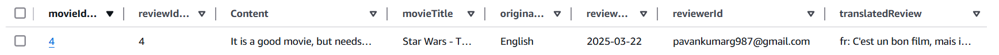

## Enterprise Web Development module - Serverless REST Assignment.

__Name:__ Pavan Gurrala

__Demo:__ https://youtu.be/ncXPUKkf1Uw

### Overview.

This is a backend project for performing CRUD operations on movie reviews, where user can get movie all reviews,filter the movie reviews by movieId with additional parameters like reviewId or reviewerId. The functionalities like sign up and confirm-signup for registering the users and sign in and sign out for allowing user to login and log out. Only logged in users can post the reviews and only the person who is actually posted the review can update and delete the review, implementing the restricted user movie review update and delete. The translation functionality will translate the movie review in the content column of the MovieReviews table.     

### App API endpoints.

[ List of the API's endpoints (excluding the Auth API) implemented ]
 

+ https://2eo4rovcm9.execute-api.eu-west-1.amazonaws.com/movies/reviews  
[GET All Reviews/Records in the MovieReview Table] 

+ https://2eo4rovcm9.execute-api.eu-west-1.amazonaws.com/movies/reviews/{movieId}  
[GET specific Review/Record from MovieReview Table by movieId] 

+ https://2eo4rovcm9.execute-api.eu-west-1.amazonaws.com/movies/reviews/{movieId}?reviewId=1  
[GET specific Review/Record from MovieReview Table by movieId and optional query string reviewId] 

+ https://2eo4rovcm9.execute-api.eu-west-1.amazonaws.com/movies/reviews/{movieId}?reviewerId=smiths@gmail.com  
[GET specific Review/Record from MovieReview Table by movieId and optional query string reviewerId] 

+ https://2eo4rovcm9.execute-api.eu-west-1.amazonaws.com/movies/reviewtranslations/reviews/{reviewId}/{movieId}/translation?language=fr  
[PATCH Translate movie review of specific movie and update the tranlsatedReview column with the translated review in the movieReviewTable] 

+ https://2eo4rovcm9.execute-api.eu-west-1.amazonaws.com/movies/reviews  
[POST Movie Review] 

+ https://2eo4rovcm9.execute-api.eu-west-1.amazonaws.com/movies/{movieId}/reviews/{reviewId}  
[PATCH Update movie review by movieId and reviewId] 

+ https://2eo4rovcm9.execute-api.eu-west-1.amazonaws.com/movies/{movieId}/reviews/{reviewId}  
[DELETE Delete the movie review by movieId and reviewId] 

### Features.

#### Translation persistence (if completed)

[ For translating the movie review in the content column in the movie reviews table following things were implemented ]
+ Added the translatedReview Column in the table by updating MovieReviews type in type.d.ts
+ Created a lambda function translateMovieReview.ts
+ In translateMovieReview.ts we need to export TranslateClient, TranslateTextCommand from "@aws-sdk/client-translate"
+ First original movie review in the content column is fetched from the table by movieId and reviewId, once the review in the content column is fetched the original review is passed as a parameter, along with language code which we get from questring string in to the "TranslateTextCommand".
+ The output of this "TranslateTextCommand" is passed in to "TranslateClient" and string output of this "TranslateClient" is stored in the variable and this variable is then passed into UpdateCommand for updating it in the translatedReview column in the movie reviews table  
+ The following image is the final result

#### Custom L2 Construct (if completed)

[State briefly the infrastructure provisioned by your custom L2 construct. Show the structure of its input props object and list the public properties it exposes, e.g. taken from the Cognito lab,

Construct Input props object:
~~~
type AuthApiProps = {
 userPoolId: string;
 userPoolClientId: string;
}
~~~
Construct public properties
~~~
export class MyConstruct extends Construct {
     public  PropertyName: type
     etc.
~~~
 ]

#### Restricted review updates (if completed)
+ Once the user is signin is successful we get token, we use this token and pass it as Cookie in the header, while updating operation is being performed.
+ This token is passed into verifyToken function in authorizer.ts which inturn invokes verifyToken function in util.ts, where this token is decoded and returns user sub is and email id. This result of the verifyToekn is assigned to "verifiedJwt" obejct in the authorizer.ts, in thereturn block the emailId is passed into the context ie., into requestContext object.  
+ In the updateMovieReview.ts we extract the emailId of signed in user from the requestContext.authorizer.emailId
+ After this reviewerId column which holds the emailId of signed in user is fetched by getCommand using movieId and reviewId as parameters.
+ Both emailId from the requestContext and emailId ie., reviewerId from the DynamoDb table are comapared with each other, if there is match then and only then the user is allowed to updated. Other we will return 403 error.     
+ The same is implemented for DELETE functionality. Thus restricting the user from accidentally deleting other reviews. 

#### API Gateway validators. (if completed)

[State where in your app API's list of endpoints you used API Gateway's Validators. Include code excerpts from your stack code that illustrate their use.]

###  Extra (If relevant).

[ State any other aspects of your solution that use CDK/serverless features not covered in the lectures ]

